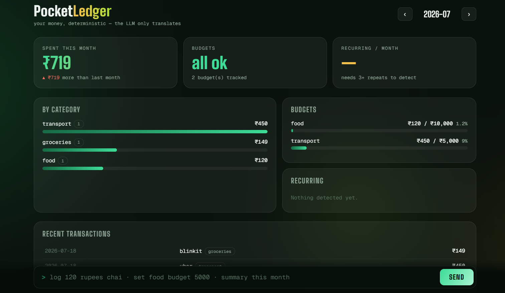

# PocketLedger


**Talk to your money in plain language. The LLM only translates — deterministic Python + SQLite does every calculation.**

> "log 120 rupees chai" &rarr; ✅ Logged ₹120.00 — chai (category: food)

Two ways to use it:

1. **Web dashboard + chat** (`chat.py`) — animated dashboard with monthly totals, category bars, budget meters, recurring-charge detection, and a terminal-style command dock. Uses a free Gemini API key for intent parsing only.
2. **MCP server** (`server.py`) — exposes the same 8 tools to any MCP client (Claude Desktop etc.) over stdio. Needs **no API key at all**.

Your data never leaves your machine except the raw text you type (sent to Gemini to figure out which tool you meant). All amounts, categories, budgets, and detections are computed locally. **The layers that judge the money contain no ML.**

## Quick start — web dashboard (Windows)

```bat
git clone https://github.com/ektamishra4321/pocketledger.git
cd pocketledger
pip install -r requirements.txt
python -m pytest              REM expect: 25 passed
```

Create a file named `.env` in the folder:

```
GEMINI_API_KEY=your_free_key_from_aistudio.google.com
```

Then:

```bat
python chat.py
```

Open **http://localhost:5050**. Try: `log 120 rupees chai`, `set food budget 5000`, `summary this month`, `find recurring`. Hinglish works: `kal 250 ka uber`.

### Gemini free-tier survival kit (built in)

Free-tier Gemini is a moving target, so `chat.py` ships with the battle scars pre-healed:

- **Model auto-discovery** — asks ListModels which models *your* key can actually use instead of hardcoding a name that Google may retire ("gemini-2.5-flash is no longer available to new users" — real error, handled).
- **Thinking-token guard** — thinking models silently burn the output budget and return truncated JSON; `thinkingConfig: {thinkingBudget: 0}` with automatic fallback for models that reject it.
- **Key redaction** — API errors never echo your key back onto the screen.
- **Fence-stripping JSON parser** — because models love wrapping JSON in ``` fences.

Pin a model manually anytime with a second line in `.env`: `GEMINI_MODEL=gemini-flash-latest`.

## The 8 tools

| Tool | What it does |
|---|---|
| `pocketledger_log_expense` | Log an expense; auto-categorizes via keyword rules (Swiggy→food, Zepto→groceries, …) |
| `pocketledger_import_statement` | Parse a bank/card CSV (Debit/Credit columns *or* single-Amount+DR/CR); hash-dedupe makes re-imports no-ops |
| `pocketledger_query_expenses` | Filter by category / dates / merchant substring |
| `pocketledger_monthly_summary` | Total, per-category breakdown, top merchants, vs. last month |
| `pocketledger_set_budget` / `pocketledger_check_budgets` | Category limits with OVER / WARNING (&ge;80%) flags |
| `pocketledger_find_recurring` | Detects weekly/monthly/quarterly/yearly charges from amount + interval regularity |
| `pocketledger_recategorize` / `pocketledger_list_categories` | Fix mistakes; see what the rules know |

## Design decisions

- **Integer paise everywhere.** ₹1 = 100 paise, stored as integers. No float money bugs, ever.
- **Deterministic categorizer.** Ordered keyword rules over normalized merchant strings (`UPI-SWIGGY-987@ybl` → `swiggy`). Unknown merchants stay honestly `uncategorized` instead of being guessed.
- **Recurring detection is arithmetic, not vibes.** &ge;3 occurrences, amounts within ±12% of median, median gap inside a cadence window.
- **Duplicate-safe by construction.** UNIQUE hash on date+amount+merchant+note.
- **Thread-safe writes.** The Flask dashboard serves requests on multiple threads; all SQLite writes serialize through a lock.

## Testing

25 deterministic tests, zero API keys needed:

```bat
python -m pytest
```

Covers money math (paise conversion, accounting negatives), Indian date formats, merchant normalization, both CSV layouts, dedupe-on-reimport, budget thresholds, and recurring-cadence detection including the irregular-spend negative case. CI runs the suite on every push.

## MCP server (no API key)

```bat
python server.py --selftest    REM expect: SELFTEST OK
```

For MCP clients that read `claude_desktop_config.json`:

```json
{
  "mcpServers": {
    "pocketledger": {
      "command": "python",
      "args": ["C:\\path\\to\\pocketledger\\server.py"]
    }
  }
}
```

A packaged `pocketledger.mcpb` / `.dxt` extension is included for versions that install extensions from file.

## Known limitations (v1)

- Some Claude Desktop builds currently neither read `claude_desktop_config.json` nor accept local extension files from the UI — on those versions, use the web dashboard (`chat.py`) instead. Tracked as an open item.
- CSV statements only; PDF statement parsing is not in v1.
- The categorizer is keyword rules tuned for Indian merchants; extend `RULES` in `categorizer.py`.
- Single-user, single-machine by design. This is a personal ledger, not a fintech product.

## License

MIT. Not financial advice; not affiliated with any bank or with Google/Anthropic.
